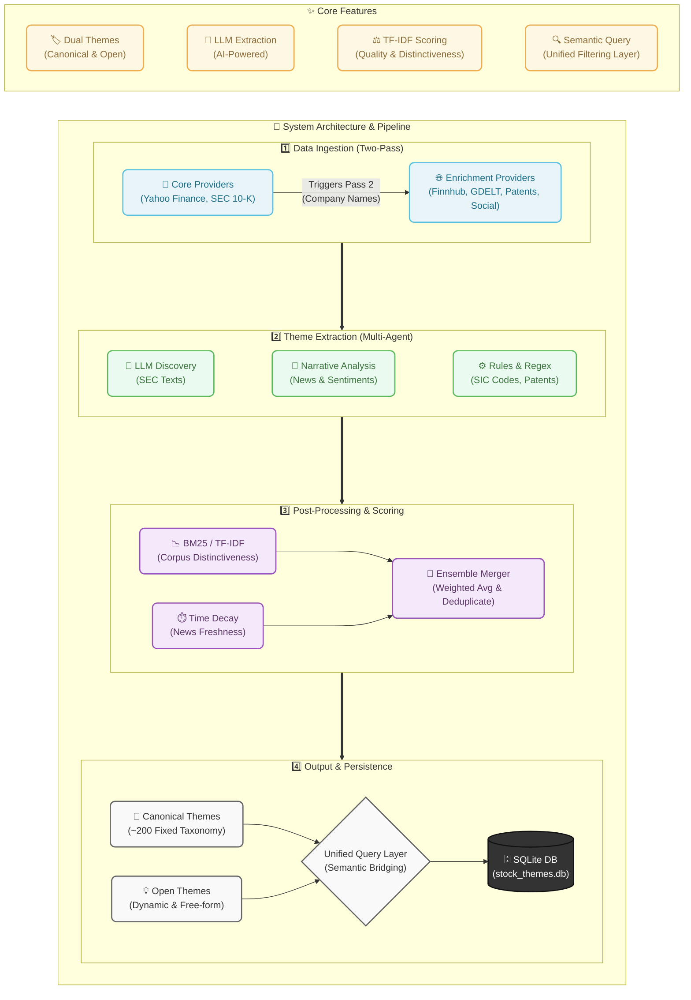

脚本加入了苹果字符重组（NFC）和容错机制
在终端运行它：

```Bash
python3 final_fix.py
```

```mermaid
flowchart TD
    %% Global Styles for Infographic Look
    classDef titleStyle fill:none,stroke:none,font-size:24px,font-weight:bold,color:#333;
    classDef feature fill:#fdf8e3,stroke:#f0ad4e,stroke-width:2px,color:#8a6d3b,rx:8px,ry:8px;
    classDef ingest fill:#e8f4f8,stroke:#5bc0de,stroke-width:2px,color:#1b6d85,rx:8px,ry:8px;
    classDef extract fill:#eafaf1,stroke:#5cb85c,stroke-width:2px,color:#3c763d,rx:8px,ry:8px;
    classDef process fill:#f4e8fb,stroke:#9954bb,stroke-width:2px,color:#5c3566,rx:8px,ry:8px;
    classDef output fill:#f9f9f9,stroke:#666666,stroke-width:2px,color:#333333,rx:8px,ry:8px;
    classDef db fill:#333333,stroke:#111111,stroke-width:2px,color:#ffffff,rx:8px,ry:8px;

    %% Features Section
    subgraph F ["✨ Core Features"]
        direction LR
        F1["🏷️ Dual Themes<br/>(Canonical & Open)"]:::feature
        F2["🧠 LLM Extraction<br/>(AI-Powered)"]:::feature
        F3["⚖️ TF-IDF Scoring<br/>(Quality & Distinctiveness)"]:::feature
        F4["🔍 Semantic Query<br/>(Unified Filtering Layer)"]:::feature
        F1 ~~~ F2 ~~~ F3 ~~~ F4
    end

    %% Architecture Pipeline
    subgraph Pipe ["🔄 System Architecture & Pipeline"]
        direction TB
        
        %% Step 1: Data
        subgraph S1 ["1️⃣ Data Ingestion (Two-Pass)"]
            direction LR
            D1["🏦 Core Providers<br/>(Yahoo Finance, SEC 10-K)"]:::ingest
            D2["🌐 Enrichment Providers<br/>(Finnhub, GDELT, Patents, Social)"]:::ingest
            D1 -- "Triggers Pass 2<br/>(Company Names)" --> D2
        end

        %% Step 2: Extraction
        subgraph S2 ["2️⃣ Theme Extraction (Multi-Agent)"]
            direction LR
            E1["🤖 LLM Discovery<br/>(SEC Texts)"]:::extract
            E2["📰 Narrative Analysis<br/>(News & Sentiments)"]:::extract
            E3["⚙️ Rules & Regex<br/>(SIC Codes, Patents)"]:::extract
            E1 ~~~ E2 ~~~ E3
        end

        %% Step 3: Processing
        subgraph S3 ["3️⃣ Post-Processing & Scoring"]
            direction LR
            P1["📉 BM25 / TF-IDF<br/>(Corpus Distinctiveness)"]:::process
            P2["⏱️ Time Decay<br/>(News Freshness)"]:::process
            P3["🔀 Ensemble Merger<br/>(Weighted Avg & Deduplicate)"]:::process
            P1 ---> P3
            P2 ---> P3
        end

        %% Step 4: Output
        subgraph S4 ["4️⃣ Output & Persistence"]
            direction LR
            O1["📌 Canonical Themes<br/>(~200 Fixed Taxonomy)"]:::output
            O2["💡 Open Themes<br/>(Dynamic & Free-form)"]:::output
            O3{"Unified Query Layer<br/>(Semantic Bridging)"}:::output
            O4[("🗄️ SQLite DB<br/>(stock_themes.db)")]:::db
            
            O1 --> O3
            O2 --> O3
            O3 --> O4
        end
        
        %% Pipeline Connections
        S1 ===> S2 ===> S3 ===> S4
    end

    %% Invisible link for layout
    F ~~~ Pipe
```
